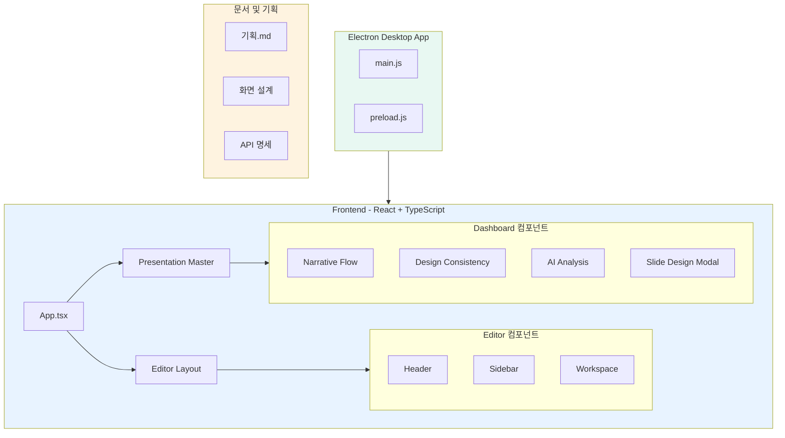

# PPTXManager

<div align="center">

**전문적인 프레젠테이션 제작을 위한 올인원 솔루션**

프레젠테이션 디자인, 스크립트 작성, 발표 연습까지 한 곳에서

</div>

---

## 📋 프로젝트 소개

**PPTXManager**는 단순한 슬라이드 편집을 넘어서, 발표의 기획부터 디자인, 스크립트 작성, 연습까지 전체 프레젠테이션 라이프사이클을 지원하는 통합 도구입니다.

### 🎯 프로젝트 비전

- **발표 설계 지원**: 슬라이드와 스크립트를 함께 관리하며 체계적인 발표 준비
- **디자인 일관성**: AI 기반 디자인 분석으로 전문적이고 통일된 프레젠테이션 제작
- **오프라인 우선**: 인터넷 없이도 모든 기능 사용 가능 (온라인 기능은 옵션)
- **효율적인 워크플로우**: MS PowerPoint의 친숙함과 현대적인 UX의 결합

---

## ✨ 주요 기능

### 1. 📝 슬라이드 편집 (Editor)
- MS PowerPoint 스타일의 직관적인 편집 인터페이스
- 기본 그래픽 요소 지원 (원, 사각형, 텍스트 박스, 이미지)
- 여러 테마와 디자인 템플릿 제공
- PPTX 파일 가져오기/내보내기

### 2. 🎯 Presentation Master (핵심 기능)
발표 준비를 위한 통합 대시보드

- **내러티브 플로우 관리**: 슬라이드별 제목, 설명, 스크립트를 한눈에
- **타임라인 관리**: 각 슬라이드의 예상 발표 시간 설정 및 전체 소요 시간 계산
- **컴팩트 뷰**: 많은 슬라이드를 효율적으로 관리하는 압축 보기 모드
- **드래그 앤 드롭**: 직관적인 슬라이드 순서 재배치

### 3. 🎨 디자인 일관성 관리 (Design Consistency)
- **자동 디자인 분석**: 폰트, 색상, 레이아웃 일관성 검사
- **통합 디자인 컨트롤**: 모든 슬라이드에 일괄 스타일 적용
- **디자인 이슈 탐지**: 불일치하는 요소 자동 감지 및 수정 제안
- **프라이머리 스타일 관리**: 프로젝트 전체의 색상 팔레트와 폰트 관리

### 4. 🤖 AI 기반 내러티브 분석
- **발표 흐름 분석**: 슬라이드 간 전환의 자연스러움 평가
- **브릿지 슬라이드 생성**: 부자연스러운 전환 구간에 연결 슬라이드 자동 제안
- **톤 일관성 체크**: 발표 전체의 어조와 스타일 분석
- **LLM 옵션**: 온라인 API 또는 로컬 모델 선택 가능

### 5. 🎤 발표 모드 (Presentation Mode)
- **프레젠테이션 모드**: 실제 발표용 전체 화면 보기
- **연습 모드**: 타이머와 스크립트를 함께 보며 리허설
- **발표 피드백**: 연습 시간 기록 및 개선점 분석

---

## 🛠 기술 스택

### Frontend
- **프레임워크**: React 18.2 + TypeScript
- **빌드 도구**: Vite 4.4
- **스타일링**: CSS Modules, CSS Variables
- **아이콘**: Google Material Symbols

### Desktop Application
- **런타임**: Electron 28
- **개발 도구**: electron-builder, concurrently
- **개발 서버**: Vite Dev Server + Electron

### 개발 환경
- **언어**: TypeScript 5.0
- **린터**: ESLint + TypeScript ESLint
- **패키지 관리**: npm

---

## 📐 프로젝트 아키텍처



---

## 📂 프로젝트 구조

```
PPTXManager/
├── Frontend/                    # 프론트엔드 애플리케이션
│   ├── electron/               # Electron 메인 프로세스
│   │   ├── main.js            # Electron 진입점
│   │   └── preload.js         # Preload 스크립트
│   ├── src/                    # React 소스 코드
│   │   ├── App.tsx            # 메인 App 컴포넌트
│   │   ├── components/        # React 컴포넌트
│   │   │   ├── Editor/        # 슬라이드 편집 화면
│   │   │   │   ├── EditorLayout.tsx
│   │   │   │   ├── Header.tsx
│   │   │   │   ├── Sidebar.tsx
│   │   │   │   └── Workspace.tsx
│   │   │   └── Dashboard/     # Presentation Master 화면
│   │   │       ├── Dashboard.tsx
│   │   │       └── SlideDesignModal.tsx
│   │   ├── styles/            # 전역 스타일
│   │   │   └── variables.css
│   │   └── main.tsx           # React 진입점
│   ├── docs/                   # 프로젝트 문서
│   │   ├── 기획.md            # 프로젝트 기획서
│   │   ├── ScreenArch/        # 화면 설계 문서
│   │   │   ├── Editor/
│   │   │   ├── Presentation_Master_Main/
│   │   │   ├── Presentation_Design/
│   │   │   ├── Presentation_Mode/
│   │   │   ├── Analysis_report/
│   │   │   └── Unify_Design_Control/
│   │   └── API 명세/          # API 문서
│   ├── package.json
│   ├── vite.config.ts
│   └── tsconfig.json
├── Backend/                     # 백엔드 서버 (예정)
└── README.md                    # 이 파일
```

---

## 🚀 설치 및 실행

### 사전 요구사항
- Node.js 16.x 이상
- npm 8.x 이상

### 설치

```bash
# 저장소 클론
git clone https://github.com/yourusername/PPTXManager.git
cd PPTXManager/Frontend

# 의존성 설치
npm install
```

### 개발 모드 실행

#### 웹 개발 모드 (브라우저)
```bash
npm run dev
```
브라우저에서 `http://localhost:5173` 접속

#### Electron 개발 모드 (데스크톱)
```bash
npm run electron:dev
```
Vite 개발 서버와 Electron이 동시에 실행됩니다.

### 빌드 (Production)

#### 웹 빌드
```bash
npm run build
```
`dist` 폴더에 정적 파일이 생성됩니다.

#### Electron 앱 빌드
```bash
npm run electron:build
```
운영체제에 맞는 실행 파일이 생성됩니다.

---

## 🎨 화면 구성

### 1. Editor (슬라이드 편집 화면)
MS PowerPoint와 유사한 인터페이스로 슬라이드를 편집합니다.

**구성 요소:**
- 상단 헤더: 도구 모음 및 Presentation Master로 이동
- 왼쪽 사이드바: 슬라이드 썸네일 목록
- 중앙 워크스페이스: 슬라이드 편집 캔버스

### 2. Presentation Master (메인 대시보드)
프레젠테이션의 전체 구조와 내러티브를 관리하는 핵심 화면입니다.

**화면 모드:**
- **Initial**: 새 프로젝트 시작 화면
- **Main**: 기본 상세 보기 (슬라이드별 제목/설명/스크립트 입력)
- **Compact View**: 압축 보기 (많은 슬라이드 관리용)

**주요 패널:**
- 프로젝트 정보 카드: 제목, 상태, 마지막 수정 정보
- 통계 카드: 총 슬라이드 수, 예상 발표 시간, 디자인 이슈 수
- Narrative Flow: 슬라이드별 내용 편집
- Design Consistency: 디자인 일관성 분석 및 수정
- AI Narrative Check: AI 기반 발표 흐름 분석

### 3. Slide Design Modal
개별 슬라이드의 세부 디자인을 설정하는 모달입니다.

### 4. Unify Design Control
모든 슬라이드에 일괄적으로 디자인을 적용하는 화면입니다.

### 5. Presentation Mode
- **Main**: 전체 화면 발표 모드
- **Practice Mode**: 스크립트와 타이머가 있는 연습 모드

### 6. Analysis Report
발표 연습 후 피드백과 개선점을 보여주는 리포트 화면입니다.

---

## 🗺 개발 로드맵

### ✅ 현재 완료된 기능
- [x] 기본 프로젝트 구조 설정
- [x] Electron + React + Vite 통합
- [x] Editor 레이아웃 구현
- [x] Presentation Master UI 구현
- [x] Dashboard 컴포넌트 (Normal/Compact View)
- [x] Design Consistency 패널
- [x] Slide Design Modal

### 🚧 개발 중
- [ ] 슬라이드 편집 기능 (도형, 텍스트, 이미지)
- [ ] PPTX 파일 가져오기/내보내기
- [ ] 디자인 일관성 자동 분석 로직

### 📅 향후 계획
- [ ] 전역 상태 관리(Zustand, Redux 등) 도입: 슬라이드 데이터, 스크립트, 디자인 설정 통합 관리
- [ ] AI 기반 내러티브 분석 (LLM 통합)
- [ ] 로컬 LLM 지원
- [ ] 발표 모드 구현
- [ ] 연습 모드 및 타이머
- [ ] 발표 피드백 리포트
- [ ] 테마 및 템플릿 라이브러리
- [ ] 클라우드 동기화 (옵션)
- [ ] 협업 기능 (옵션)

---

## 📖 문서

- [프로젝트 기획서](Frontend/docs/기획.md)
- [화면 설계 문서](Frontend/docs/ScreenArch/)
- API 명세 (작성 예정)

---